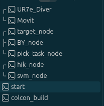

## ROS2 指令整合:

### 0. 如果修改过以下源码，先编译一次

target_motion_node.cpp\
gripper_io_node.cpp\
pick_task_node.cpp\
motion.yaml\
CMakeLists.txt

```sh
cd ~/UR7e/ros2_ws

source /opt/ros/jazzy/setup.bash

colcon build \
  --packages-select ur7e_motion ur7e_vision \
  --symlink-install

source ~/UR7e/ros2_ws/install/setup.bash
```

如果只修改了：\

```yaml
motion.yaml
vision.yaml
```

通常不用重新编译，只需要重启对应节点。\

建立终端：\

### 1. 启动 UR7e Driver

```sh
cd ~/UR7e

source /opt/ros/jazzy/setup.bash
source ~/UR7e/ros2_ws/install/setup.bash

./scripts/start_driver.sh
```

用来连接UR7e机械臂和ROS2系统，打开后，要在示教器上电机程序运行，程序进入Control by Ubuntu_ros2块完成连接。\

命令检查是否连接成功：

```sh
ros2 topic echo \
/io_and_status_controller/
robot_program_running \
--once
```

返回必须：

```sh
data: true
```

有时如果不长时间操作，程序会自动断开，这是需要重新在示教器上点击运行。\

UR7e的相关IP设置：

```yaml
Robot IP:
192.168.0.10 # 在示教器上设置

Ubuntu:
192.168.0.11 # 在Ubuntu上设置网络，并且同时在示教器将host设置为为该值
```

### 2. 启动MoveIt2

```sh
cd ~/UR7e

source /opt/ros/jazzy/setup.bash
source ~/UR7e/ros2_ws/install/setup.bash

./scripts/start_moveit.sh
```

ROS2官方运动学逆解求解器，同时会打卡RViz进行可视化仿真

启动后先不要乱点 RViz 的：

```yaml
Plan & Execute
Execute
```

因为后面由我们的节点控制机械臂。

### 3. 启动 target_motion_node

```sh
source /opt/ros/jazzy/setup.bash
source ~/UR7e/ros2_ws/install/setup.bash

ros2 run ur7e_motion target_motion_node \
  --ros-args \
  --params-file \
  ~/UR7e/ros2_ws/src/ur7e_motion/config/motion.yaml
```

负责：

```yaml
/ur7e/plan_to_target
/ur7e/execute_last_plan

/ur7e/move_to_target

/ur7e/set_home_here
/ur7e/home_status
/ur7e/go_home
/ur7e/plan_home

/ur7e/stop
```

### 4. 启动 BY-P80 手爪

```sh
source /opt/ros/jazzy/setup.bash
source ~/UR7e/ros2_ws/install/setup.bash

ros2 run ur7e_motion gripper_io_node \
  --ros-args \
  --params-file \
  ~/UR7e/ros2_ws/src/ur7e_motion/config/motion.yaml
```

用来控制BY机械爪,具体而言通过数据信号进行控制:

```yaml
DO0 → BY-P80 控制
DI0 ← BY-P80 完成反馈

DO0 = ON
→ Open

DO0 = OFF
→ Close
```

对应的手动打开终端指令：

```sh
ros2 service call \
/gripper/status \
std_srvs/srv/Trigger \
"{}"
```

关闭指令：

```sh
ros2 service call \
/gripper/close \
std_srvs/srv/Trigger \
"{}"
```

### 5. 启动HIK工业相机

```sh
source ~/.bashrc

source /opt/ros/jazzy/setup.bash
source ~/UR7e/ros2_ws/install/setup.bash

ros2 run ur7e_vision hik_camera_node \
  --ros-args \
  --params-file \
  ~/UR7e/ros2_ws/src/ur7e_vision/config/vision.yaml
```

相机的IP配置：

```yaml
HIK Camera:
192.168.1.20

Ubuntu Camera NIC:
192.168.1.21
```

相机节点启动拍照信号--手动：

```sh
ros2 topic pub --once \
/hik_camera/run_once \
std_msgs/msg/Empty \
"{}"
```

收到以后进行 5 帧采集,将返回：

```sh
Burst frame 1/5 published
Burst frame 2/5 published
Burst frame 3/5 published
Burst frame 4/5 published
Burst frame 5/5 published

Run Once burst finished:
5/5 frames
success=True
```

打开可视化图像节点：

```sh
ros2 run rqt_image_view rqt_image_view
```

### 6. 启动 SVM 目标检测

```sh
source ~/.bashrc

source /opt/ros/jazzy/setup.bash
source ~/UR7e/ros2_ws/install/setup.bash

ros2 run ur7e_vision svm_detector_node \
  --ros-args \
  --params-file \
  ~/UR7e/ros2_ws/src/ur7e_vision/config/vision.yaml
```

完成识别过程：

```yaml
轮廓提取
↓
HOG
↓
Hu矩
↓
几何特征
↓
SVM分类
↓
连续5帧稳定定位
↓
Homography
```

最终发布：

```yaml
/vision/target_pose
/vision/target_class
/vision/debug_image
```

### 7. 启动 pick_task_node

```sh
source /opt/ros/jazzy/setup.bash
source ~/UR7e/ros2_ws/install/setup.bash

ros2 run ur7e_motion pick_task_node \
  --ros-args \
  --params-file \
  ~/UR7e/ros2_ws/src/ur7e_motion/config/motion.yaml
```

**手动执行：**

```sh
ros2 service call \
/pick/start \
std_srvs/srv/Trigger \
"{}"
```
**手动停止：**
```sh
ros2 service call \
/pick/stop \
std_srvs/srv/Trigger \
"{}"
```

主要负责：

```yaml
/pick/start
↓
HOME
↓
等待机械臂稳定
↓
/hik_camera/run_once
↓
HIK 连续5帧
↓
SVM稳定定位
↓
获得 /vision/target_pose
↓
OPEN
↓
PREGRASP
↓
GRASP
↓
CLOSE
↓
等待 DI0
↓
LIFT
↓
HOME
```

第一次定位home位置：首先使用示教器将机械臂移动到指定位置后执行

```sh
ros2 service call \
/ur7e/set_home_here \
std_srvs/srv/Trigger \
"{}"
```

会返回类似6个关节变量的值：

```sh
home_joint_values:
[-1.53, -1.24, -1.88, -1.47, 1.57, 0.01]
```

方法motion.yaml文件里面后，测试回Home:

```sh
ros2 service call \
/ur7e/go_home \
std_srvs/srv/Trigger \
"{}"
```

## 重要配置文件

### 1. 相机坐标变换homography.yaml

```yaml
homography:
  rows: 3
  cols: 3
  data:
    - 4.462446229603872e-05
    - -4.0258352878118734e-05
    - 0.19625210545615066
    - -4.661215378738129e-05
    - -4.455875761005621e-05
    - -0.35949874383164926
    - 1.1499229293324842e-05
    - 2.5502431503892313e-06
    - 1.0
calibration:
  point_count: 18
  mean_xy_error_m: 0.0009254134903210749
  max_xy_error_m: 0.002870496919034476
```

## 其他常用指令

1. 输出TCP坐标（position+orientation）

```sh
ros2 topic echo /tcp_pose_broadcaster/pose --once
```

## VScode主题配置

```json
{
  "editor.mouseWheelZoom": true,
  "workbench.activityBar.location": "bottom",
  "files.autoSave": "afterDelay",
  "explorer.confirmDragAndDrop": false,
  "explorer.confirmDelete": false,
  "security.workspace.trust.untrustedFiles": "open",
  "editor.defaultFormatter": "esbenp.prettier-vscode",
  "editor.formatOnSave": true,
  "liveServer.settings.donotShowInfoMsg": true,
  "editor.fontFamily": "JetBrains Mono, 'Droid Sans Mono', monospace",
  "editor.cursorBlinking": "smooth",
  "workbench.iconTheme": "material-icon-theme",
  "editor.minimap.enabled": false,
  "workbench.colorTheme": "Solarized Dark",
  "editor.fontSize": 14,
  "workbench.colorCustomizations": {
    "editorCursor.foreground": "#FFFFFF",
    "editorMultiCursor.primary.foreground": "#FFFFFF",
    "editorMultiCursor.secondary.foreground": "#FFFFFF",
    "terminalCursor.foreground": "#FFFFFF"
  },
  "editor.semanticHighlighting.enabled": true,

  "editor.tokenColorCustomizations": {
    "[Solarized Dark]": {
      "textMateRules": [
        {
          "scope": [
            "entity.name.type",
            "entity.name.type.class",
            "support.type",
            "support.class"
          ],
          "settings": {
            "foreground": "#D9B86C"
          }
        },
        {
          "scope": [
            "entity.name.function.member",
            "meta.function-call",
            "variable.function"
          ],
          "settings": {
            "foreground": "#73C6A8"
          }
        },
        {
          "scope": ["variable", "variable.other", "variable.other.readwrite"],
          "settings": {
            "foreground": "#AFAFA0"
          }
        },
        {
          "scope": ["variable.parameter"],
          "settings": {
            "foreground": "#C8C5B8"
          }
        },
        {
          "scope": ["constant.numeric", "constant.language"],
          "settings": {
            "foreground": "#B79ACB"
          }
        },
        {
          "scope": ["comment", "punctuation.definition.comment"],
          "settings": {
            "foreground": "#6F817E"
          }
        }
      ]
    }
  },
  "window.customTitleBarVisibility": "windowed",
  "git.autofetch": true,
  "git.enableSmartCommit": true,
  "git.confirmSync": false
}
```
