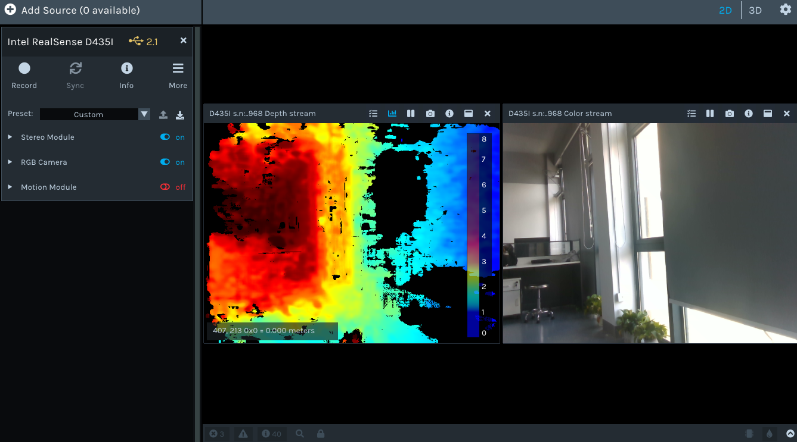
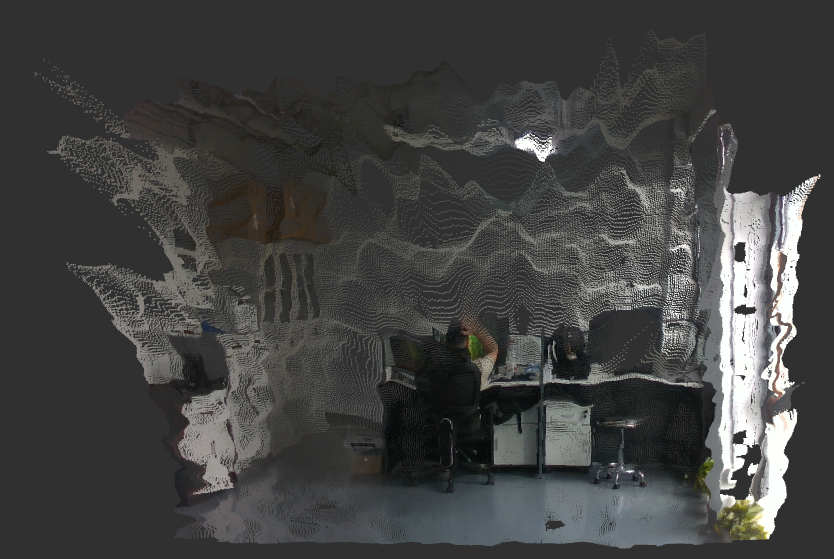
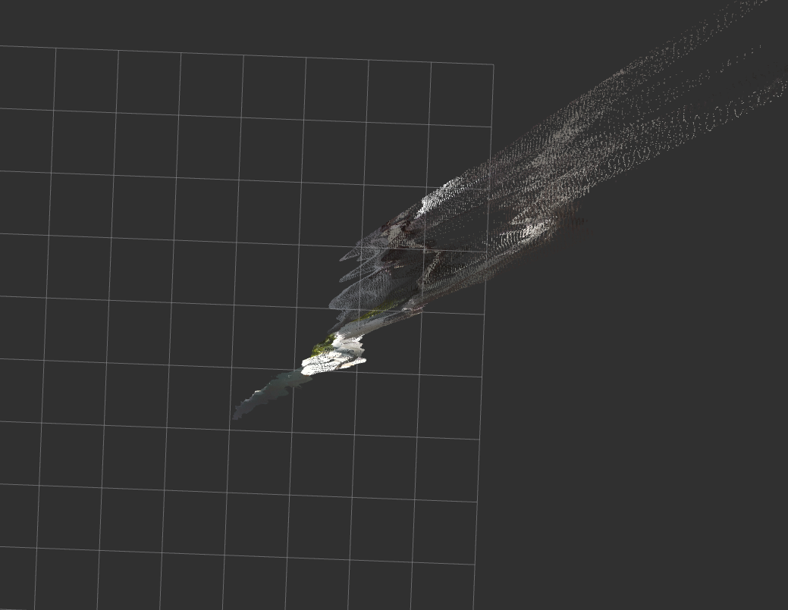
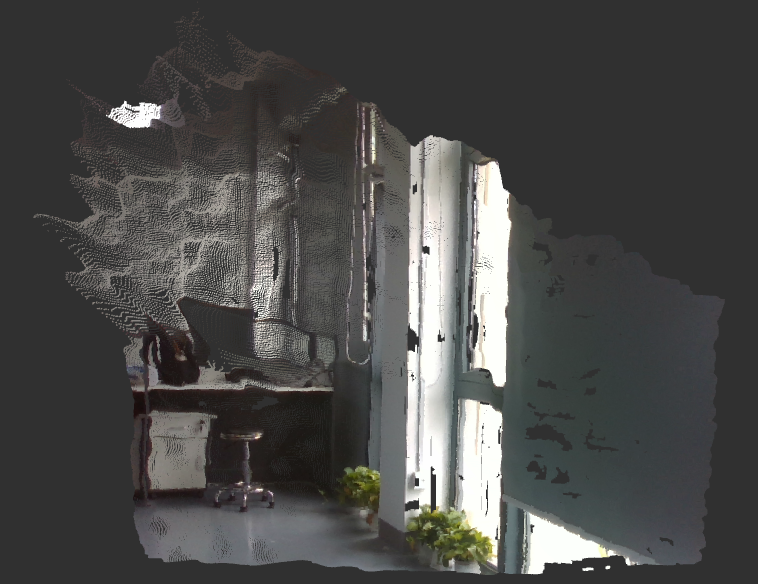

# Realsense调试指令

## 1. python调试
```py
import pyrealsense2 as rs
import numpy as np
import cv2

ctx = rs.context()
devices = ctx.query_devices()
print("device count:", len(devices))
for dev in devices:
    print(dev.get_info(rs.camera_info.name))

pipeline = rs.pipeline() # 定义管线
config = rs.config() # 定义配置实例

config.enable_stream( # 使能数据流，并且配置
    rs.stream.color, # 彩色流
    640, # width
    480, # height
    rs.format.bgr8,
    30 # FPS
)
config.enable_stream(
    rs.stream.depth, # 深度流
    640, # width
    480, # height
    rs.format.z16,
    30
)

pipeline.start(config)

try:
    while True:
        frames = pipeline.wait_for_frames() # 等待帧数

        color_frame = frames.get_color_frame() # 分出彩色帧
        depth_frame = frames.get_depth_frame() # 分出深度帧
        if not color_frame or not depth_frame:
            continue

        # 转成array数组便于cv计算
        color_image = np.asanyarray(
            color_frame.get_data()
        )
        depth_image = np.asanyarray(
            depth_frame.get_data()
        )

        # 将深度信息转换成彩色的图像
        depth_colormap = cv2.applyColorMap(
            cv2.convertScaleAbs(
                depth_image,
                alpha=0.03
            ),
            cv2.COLORMAP_JET
        )

        cv2.imshow(
            "RGB",
            color_image
        )
        cv2.imshow(
            "Depth",
            depth_colormap
        )

        if cv2.waitKey(1)==27: # key=27表示Esc键
            break
finally:
    pipeline.stop()
    cv2.destroyAllWindows()
```

## 2. realsense-viewer调试

**Intel RealSense Viewer** 是英特尔官方提供的深度相机可视化与调试工具（Intel 官方 GUI 工具），支持多种Intel RealSense设备。它允许用户实时查看和调试深度、红外和彩色图像数据流，广泛应用于计算机视觉、机器人导航、三维重建等领域。
通过以下终端命令打开：
```sh
realsense-viewer
```
总共有三种模式，包含“Stereo Module”（立体空间模式）、“RGB”（彩色相机）、“Motion Module”（运动模式）
## 3. Ros话题调试
```sh
ros2 launch realsense2_camera rs_launch.py \
pointcloud.enable:=true
```
## 4. 点云图可视化
```sh
rviz2
```
点击左下角Add，选择By topic\
->/camera/camera/depth/color/points/pointsCloud2




